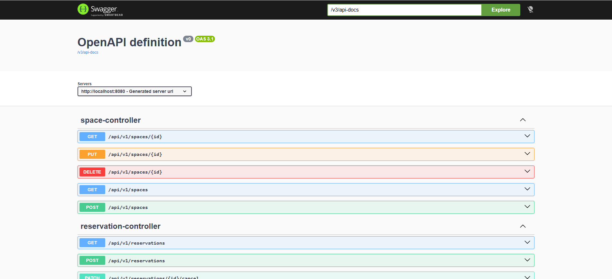
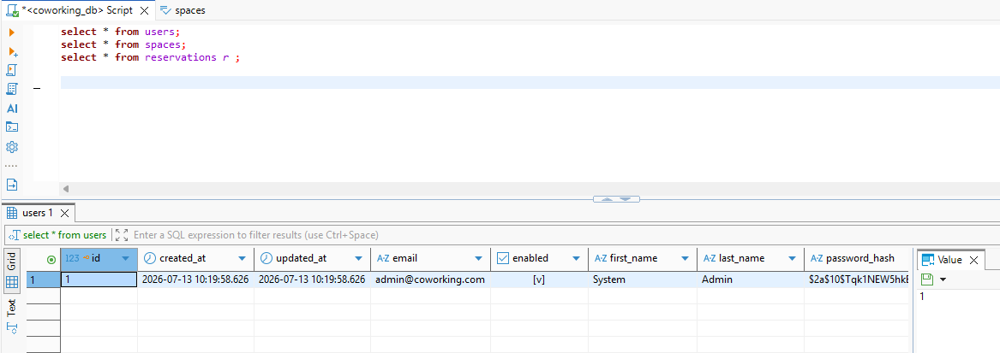
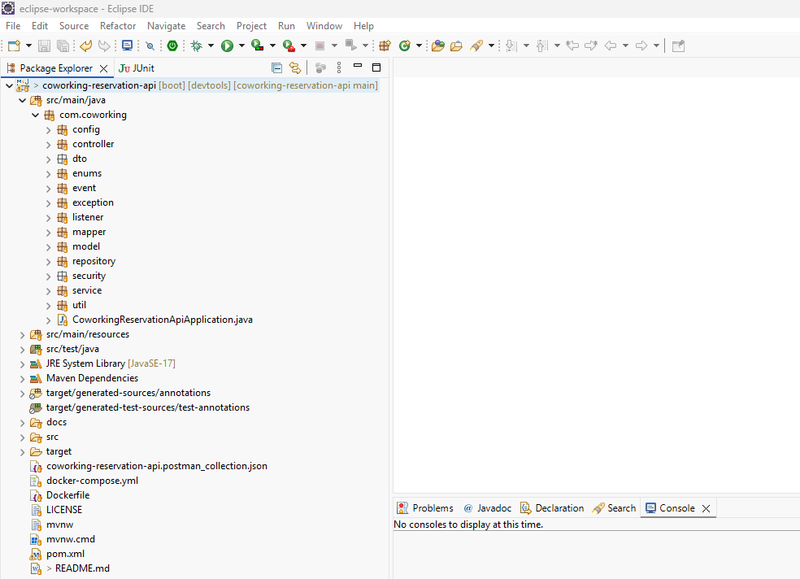
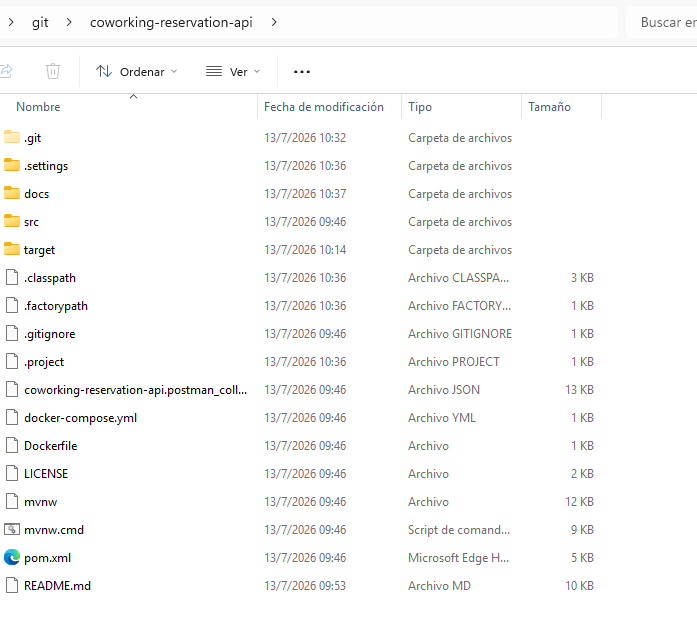

# Coworking Reservation API

Microservicio REST para la gestión de reservas de espacios de coworking desarrollado como prueba técnica utilizando Java 17 y Spring Boot 3.


# Decisiones técnicas

## Java 17 + Spring Boot 3

Se utilizó Java 17 por ser una versión LTS ampliamente utilizada en entornos empresariales y compatible con Spring Boot 3. Spring Boot 3 simplifica la configuración del proyecto e integra de forma nativa componentes como Spring Security, JPA, Actuator y Bean Validation.

## Spring Data JPA

Se utilizó Spring Data JPA para simplificar el acceso a datos mediante repositorios. Se implementaron relaciones entre entidades y consultas personalizadas con `@Query` para resolver casos específicos como la validación de reservas solapadas y el reporte de ocupación.

## Spring Security + JWT

La autenticación se implementó mediante JWT para mantener la API stateless. La autorización basada en roles (`ROLE_ADMIN` y `ROLE_USER`) permite restringir el acceso a los distintos endpoints según el perfil del usuario.

## Bean Validation + ControllerAdvice

Se utilizó Jakarta Bean Validation para validar las solicitudes antes de llegar a la lógica de negocio. El manejo centralizado de excepciones mediante `@RestControllerAdvice` proporciona respuestas consistentes y mensajes de error descriptivos.

## Spring Boot Actuator

Se habilitó Actuator para exponer endpoints de monitoreo (`health`, `info`, `metrics` y `circuitbreakers`), facilitando la observabilidad de la aplicación.

## Profiles y ConfigurationProperties

La configuración se separó por perfiles (`application-dev.yml` y `application-prod.yml`) y se centralizó mediante `@ConfigurationProperties`, evitando el uso disperso de `@Value`.

## Spring Cache

Se utilizó `@Cacheable` para optimizar el cálculo del reporte de ocupación y `@CacheEvict` para invalidar la información cuando una reserva modifica la ocupación.

## Eventos de dominio y procesamiento asíncrono

Se utilizó `ApplicationEventPublisher` junto con `@EventListener` y `@Async` para desacoplar la confirmación de una reserva del envío de la notificación, evitando bloquear la respuesta HTTP.

## Manejo transaccional

Las operaciones críticas de reserva utilizan `@Transactional` para garantizar la consistencia de los datos, especialmente durante la validación de reservas solapadas.

## OpenAPI / Swagger

Se integró Swagger para generar automáticamente la documentación de la API y facilitar las pruebas de los endpoints.

## Docker

Se utilizó Docker Compose para levantar PostgreSQL de forma sencilla y reproducible durante el desarrollo. Además, el proyecto incluye un Dockerfile para la construcción de la aplicación.
El proyecto incluye un Dockerfile para la aplicación y un docker-compose.yml para levantar PostgreSQL durante el desarrollo.

## Resilience4j

La llamada al servicio externo de validación de pagos se protegió mediante un Circuit Breaker configurado con Resilience4j. Cuando el servicio presenta fallos repetidos, el circuito se abre y un método fallback mantiene la reserva en estado `PENDING`, evitando afectar la disponibilidad del sistema.

---

# Arquitectura

El proyecto está organizado por capas:

- Controller
- Service
- Repository
- Model
- DTO
- Mapper
- Configuration
- Security
- Exception Handling

Se utiliza una arquitectura desacoplada basada en DTOs para evitar exponer directamente las entidades del dominio.

---

# Funcionalidades

## Autenticación

- Registro de usuarios
- Login mediante JWT
- Contraseñas almacenadas con BCrypt

## Espacios

- CRUD completo
- Acceso restringido por roles

## Reservas

- Crear reserva
- Consultar reservas propias
- Cancelar reservas
- Validación de solapamientos
- Administración completa para usuarios ADMIN

## Reportes

- Reporte de ocupación por rango de fechas
- Cache mediante Spring Cache

## Integraciones

- Simulación de validación de pago
- Circuit Breaker mediante Resilience4j
- Notificación asíncrona de confirmación

---

# Patrones utilizados

## Observer

Se implementó el patrón Observer utilizando `ApplicationEventPublisher` y `@EventListener`.

Cuando una reserva es confirmada se publica un evento de dominio (`ReservationCreatedEvent`) que es consumido por un listener encargado de enviar la notificación de forma asíncrona.

Este enfoque evita acoplar el servicio de reservas con la lógica de notificación y permite incorporar nuevos comportamientos reaccionando al mismo evento sin modificar la lógica existente, evitando soluciones basadas en múltiples sentencias `if` o `switch`.

---

# Circuit Breaker

La validación de pago se realiza contra un servicio externo simulado.

Se utiliza Resilience4j para:

- detectar fallos repetitivos
- abrir el circuito
- ejecutar un método fallback
- dejar la reserva en estado PENDING cuando el servicio no está disponible

El estado del circuito puede consultarse mediante Actuator.

---

# Seguridad

Spring Security + JWT

Roles soportados:

- ROLE_ADMIN
- ROLE_USER

---

# Actuator

Se encuentran habilitados:

- /actuator/health
- /actuator/info
- /actuator/metrics
- /actuator/circuitbreakers

---

# Configuración

Se utiliza ConfigurationProperties para centralizar la configuración de:

- JWT
- Servicio de pago

---

# Base de datos

PostgreSQL

La base de datos se ejecuta mediante Docker Compose.

---

# Ejecución del proyecto

# Prerrequisitos

- Java 17 o superior
- Maven 3.9+
- Docker Desktop (o Docker Engine + Docker Compose)
- Git

## 1. Clonar el repositorio

```bash
git clone https://github.com/marioalfonsocruz9/coworking-reservation-api.git
cd coworking-reservation-api
```

---

## 2. Levantar PostgreSQL

El proyecto utiliza PostgreSQL ejecutándose mediante Docker Compose.

```bash
docker compose up -d
```

Verificar que el contenedor esté en ejecución:

```bash
docker ps
```

---

## 3. Compilar el proyecto

```bash
mvn clean install
```

---

## 4. Ejecutar la aplicación

Desde Maven:

```bash
mvn spring-boot:run
```

o importando el proyecto como **Maven Project** en Eclipse o IntelliJ IDEA y ejecutando la clase:

```
CoworkingReservationApiApplication
```

El proyecto utiliza por defecto el perfil:

```
dev
```

---

## 5. Acceder a Swagger

```
http://localhost:8080/swagger-ui/index.html
```

---

## 6. Importar la colección de Postman

Importe el archivo:

```
coworking-reservation-api.postman_collection.json
```

Configure las variables de la colección:

| Variable | Valor |
|----------|-------|
| `base_url` | `http://localhost:8080` |
| `api_prefix` | `/api/v1` |

Una vez realizado el login, el JWT deberá asignarse a la variable `auth_token` para autenticar el resto de las peticiones.

---


# Usuarios de prueba

Al iniciar la aplicación con el perfil **dev**, se ejecuta un inicializador (`DevDataInitializer`) que crea automáticamente un usuario administrador para facilitar las pruebas.

### Administrador

```
Email: admin@coworking.com
Password: MyAdmin99*
Role: ROLE_ADMIN
```

> Sustituya los valores anteriores por las credenciales definidas en `DevDataInitializer`.

Los usuarios con rol **ROLE_USER** pueden registrarse mediante el endpoint:

```
POST /api/v1/auth/register
```

Las contraseñas se almacenan utilizando BCrypt.

> **Nota:** El usuario administrador solo se crea automáticamente cuando la aplicación se ejecuta con el perfil `dev`.

---

# Endpoints principales

## Autenticación

- POST /api/v1/auth/register
- POST /api/v1/auth/login

## Espacios

- GET /api/v1/spaces
- GET /api/v1/spaces/{id}
- POST /api/v1/spaces
- PUT /api/v1/spaces/{id}
- DELETE /api/v1/spaces/{id}

## Reservas

- POST /api/v1/reservations
- GET /api/v1/reservations/me
- GET /api/v1/reservations
- PATCH /api/v1/reservations/{id}/cancel

## Reportes

- GET /api/v1/reports/occupancy

---


# Postman Collection

El proyecto incluye una colección de Postman para facilitar la validación de todos los casos de uso implementados.

## Archivo

```
coworking-reservation-api.postman_collection.json
```

## Variables de la colección

Antes de ejecutar las peticiones configure las siguientes variables:

| Variable | Valor |
|----------|-------|
| `base_url` | `http://localhost:8080` |
| `api_prefix` | `/api/v1` |
| `auth_token` | Token JWT obtenido desde el endpoint de Login |

> **Nota:** La colección utiliza autenticación Bearer a nivel global. Una vez obtenido el JWT desde cualquiera de los endpoints de Login, copie el valor del campo `token` en la variable `auth_token` para autenticar automáticamente el resto de las peticiones.

---


# Decisiones de diseño

- Arquitectura por capas.
- DTOs para desacoplar la API del modelo de persistencia.
- Manejo centralizado de excepciones mediante ControllerAdvice.
- Validaciones mediante Jakarta Validation.
- Procesamiento asíncrono utilizando @Async.
- Publicación de eventos mediante ApplicationEventPublisher.
- Caché utilizando Spring Cache.
- Integración resiliente mediante Circuit Breaker.
- Configuración centralizada utilizando @ConfigurationProperties.


# Mejoras futuras

- Incorporar pruebas de integración con Testcontainers.
- Integrar un proveedor de correo electrónico real.
- Sustituir el servicio de pago simulado por una integración real.
- Desplegar la aplicación completamente mediante Docker Compose incluyendo la API.


# Testing

El proyecto incorpora la infraestructura necesaria para pruebas mediante `spring-boot-starter-test` y `spring-security-test`.

Debido al tiempo disponible para la prueba técnica se priorizó la implementación de los requisitos funcionales y no funcionales solicitados. Como trabajo futuro se incorporarían pruebas unitarias con Mockito y pruebas de integración utilizando PostgreSQL mediante Testcontainers para garantizar un entorno completamente aislado y reproducible.


## Lombok Setup in Eclipse

This project uses Lombok.

### 1. Download Lombok

Download Lombok from:

[Project Lombok](https://projectlombok.org/download)

Or take it from .m2 folder

---

### 2. Install Lombok in Eclipse

Run the downloaded `.jar` file:

```bash
java -jar lombok.jar
```

## Screenshots Database Console









# Author

Mario Alfonso Cruz Vásquez

Senior Java Backend Developer